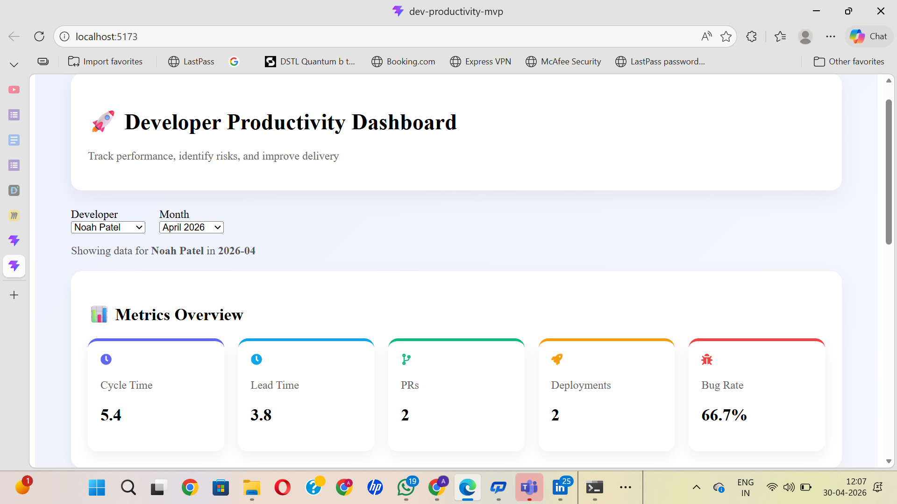
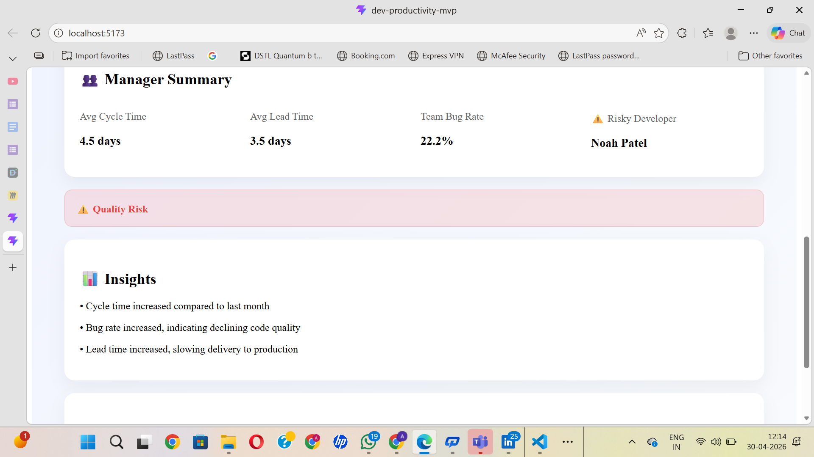

# 🚀 Developer Productivity Dashboard

A smart dashboard that transforms engineering data into actionable insights — helping teams improve delivery speed, code quality, and developer productivity.

---

## 🎯 Problem

Engineering teams often struggle with:

* Lack of visibility into developer performance
* Difficulty identifying risks early
* No clear insights from raw engineering data

This leads to slower delivery, hidden quality issues, and inefficient decision-making.

---

## 💡 Solution

This dashboard analyzes engineering signals (Jira issues, deployments, pull requests, and bugs) to:

* 📊 Measure performance
* ⚠️ Identify risky developers
* 🧠 Generate actionable insights
* 📈 Enable data-driven improvements

---

## ✨ Features

### 📊 Metrics Overview

* Cycle Time
* Lead Time
* Pull Requests
* Deployments
* Bug Rate

### ⚠️ Risk Detection

* Automatically identifies high-risk developers based on bug trends

### 🧠 Smart Insights Engine

* Detects performance trends (increase/decrease)
* Provides clear recommendations

### 🔄 Month-over-Month Analysis

* Tracks improvement or degradation over time

### 👥 Manager Summary

* Team-level averages
* Risky developer identification

---

## 📸 Screenshots

### 🚀 Dashboard Overview



### 📊 Insights & Suggestions



---

## 🧠 System Design & User Flow

This project was designed using structured product thinking, covering:

* User actions (Developers & Managers)
* System behavior and data flow
* Insights generation logic
* Pain points and opportunities

👉 View full Miro board:
https://miro.com/app/board/uXjVHaJKq2s=/?share_link_id=687978719019

---

## 🎥 Demo Video

👉 Watch full demo here:
https://drive.google.com/file/d/1CAY8hvycyePA4PGoB1y7owUf-wPurb51/view?usp=sharing

---

## 🧱 Tech Stack

* React
* Vite
* JavaScript
* Mock API (simulated async behavior)

---

## ⚙️ Run Locally

```bash
npm install
npm run dev
```

Open: http://localhost:5173

---

## 📊 How It Works

1. Select developer and month
2. Fetch data via mock API
3. Compute metrics:

   * Cycle time
   * Lead time
   * Bug rate
4. Insights engine:

   * Compares with previous data
   * Detects trends
   * Generates suggestions
5. Team analytics:

   * Calculates team averages
   * Identifies risky developer

---

## 💡 Key Idea

Turn engineering data into actionable insights so developers and managers can make smarter decisions and continuously improve performance.

---

## 🚀 Future Improvements

* Real API integration (Jira, GitHub)
* Authentication & user roles
* Historical trend visualizations
* Team comparison dashboard
* Exportable reports

---

## 👤 Author

Atul Sharma
